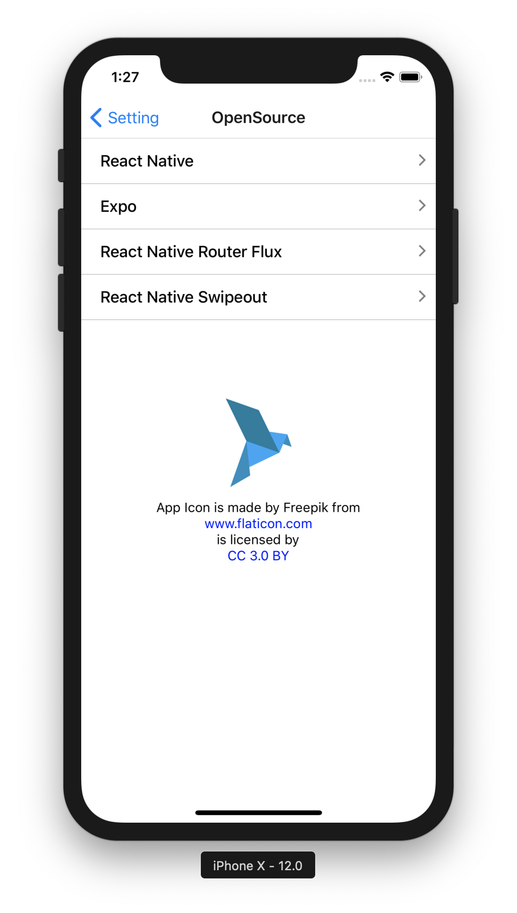

# Blue Bird

Simple push notification receiver app for both ios and android.


**Blue Bird is an open source mobile application that makes easier for developers to give "Push Notifications" to the app when needed.**


For examples
1. When my server's CPU utilization is over 90%.
2. When my server's Memory utilization is over 90%
3. When my customer bought product through web application.
4. Any Back-End Transactions.
5. etc..

Developers can make an simple API call with given tokens to send push notifications to the Blue Bird.

**Since this projects is using EXPO, there is no needs for Google's Firebase or any Cloud Messaging service.**

**Expo and Sysmetic Co. is handling & saving all the push notification datas for you**

All pull requests are welcomed!

# Author
<div>Yoo Seung Jae from <a href="http://www.sysmetic.co.kr/">Sysemtic Co.</a> </div>
<div>Icons made by <a href="http://www.freepik.com" title="Freepik">Freepik</a> from <a href="https://www.flaticon.com/" title="Flaticon">www.flaticon.com</a> is licensed by <a href="http://creativecommons.org/licenses/by/3.0/" title="Creative Commons BY 3.0" target="_blank">CC 3.0 BY</a></div>

## Requirements
- nodejs
- expo-cli
- exp
- react-native

## How To Send Push Notification
You can send push notification using POST method to "http://bluebird.sysmetic.co.kr/send"

example of how to send push notification to Blue Bird is as follows using curl

1. Example1
```
curl -H "Content-Type: application/json" -X POST "http://bluebird.sysmetic.co.kr/send" -d '{
  "tokens": [
    "ExponentPushToken[0updZpOAwg3LL9iRnf_vAH]",
    "ExponentPushToken[0updZpOAwg3LL9iRnf_vAH]"
  ],
  "title": "title of push notification",
  "body": "content of push notification",
  "link": "http://www.sysmetic.co.kr",
  "color": "#377B9C"
}'
```
2. Example2
```
curl -H "Content-Type: application/json" -X POST "http://bluebird.sysmetic.co.kr/send" -d '{
  "tokens": [
    "ExponentPushToken[0updZpOAwg3LL9iRnf_vAH]"
  ],
  "title": "[서버 경고]CPU 사용량 90% 이상입니다.",
  "body": "트래픽 증가로 인한 서버의 CPU 사용량이 90% 이상입니다. 서버의 Scale을 늘려주세요.",
  "link": "http://www.sysmetic.co.kr",
  "color": "#E10003"
}'
```

Request parameters | Values | Required
---------- | ------ | -------
tokens | Array[string] | True
title | string | True
body | string | True
link | string | False
color | string | False


## How To Run App
1. go to bluebird directory where package.json exists.
2. in command run "npm install"
3. in command run "expo start"


## sample pictures
<kbd></kbd>
<kbd>

</kbd>

<kbd>

</kbd>
