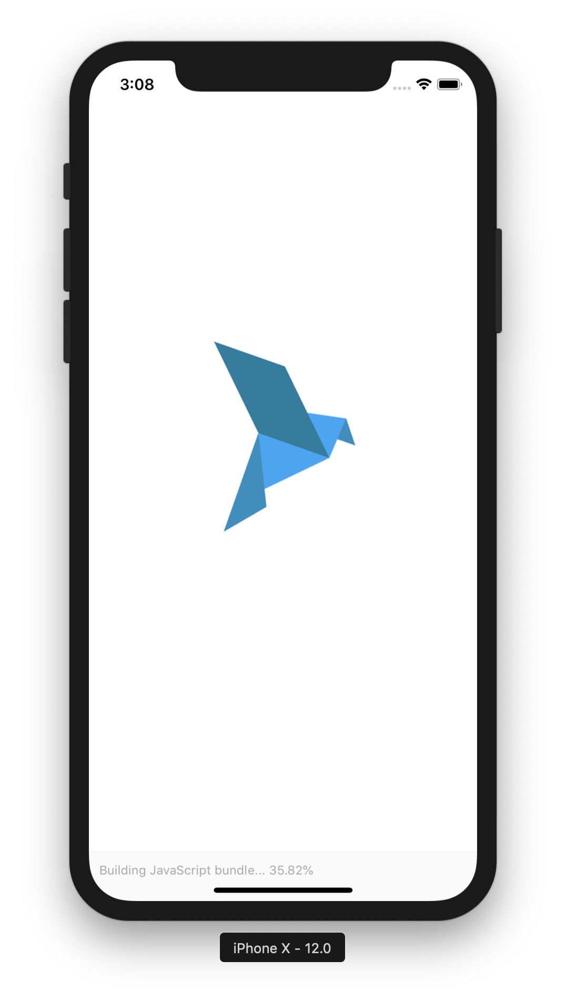

# bluebird
Push Notification receiver mobile app for both ios and android

## Requirements
- nodejs
- expo-cli
- exp
- react-native

## How To Run
1. go to bluebird directory where package.json exists.
2. in command run "npm install"
3. in command run "expo start"

## sample pictures
 
